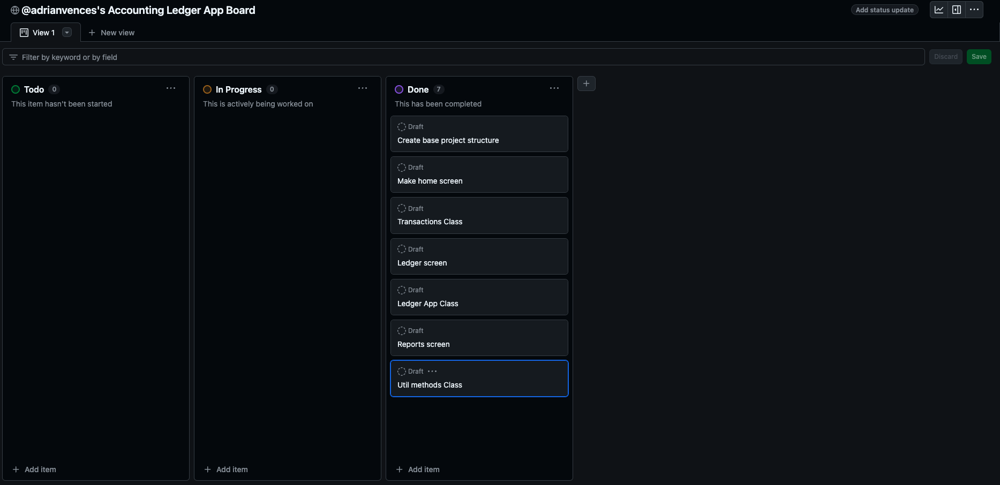
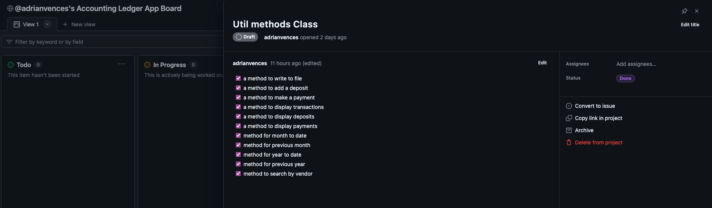
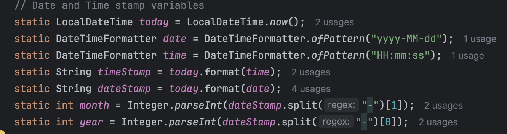
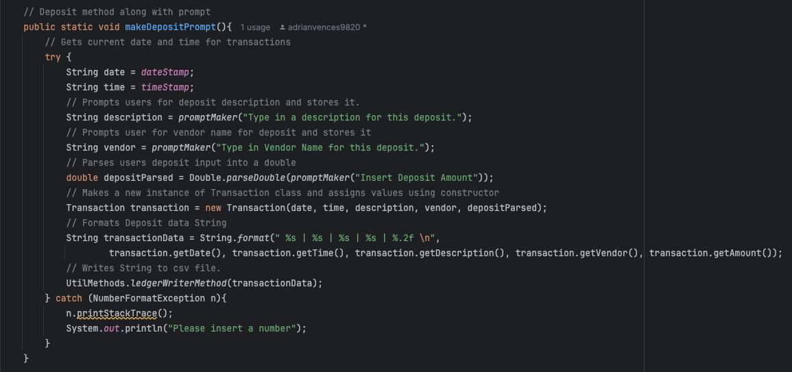
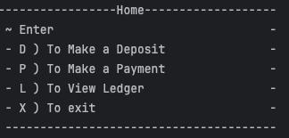
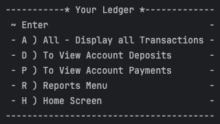
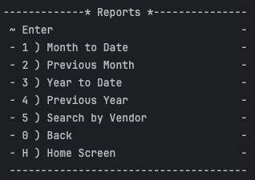

# Accounting-Ledger-Application

## By: Adrian Vences

In my accounting ledger project, I developed an application using java to manage payments and deposit 
transactions.The project featured a Class named Transactions that handles transactions helping organize
data. I implemented BufferedReaders and FileReaders for efficient file input,along with bufferedWriters
for output. I created three screens that were required by the capstone but also help improve the users 
experience. Throughout my project I focused on encapsulating functionality into methods to improve maintainability
and readability. This approach cleaned up my code and also helped me grow by become a less repetitive coder. 

## ---------------------- Github Project Board ---------------------
For this project one of my main focuses was being more organized and forming clear and better code
than i usually write. Using a project board was a great idea. Firstly, it allowed me to organize tasks and
prioritize features. It allowed me to track progress and be able to check tasks of the list, once all the 
tasks of that feature were completed I could move them to the Done section. 
Overall , the Github project board helped my workflow and make everything more efficient and structured. 

## --------------------------- Interesting Code ------------------------
This code effectively captures the current date and time using Java's LocalDateTime 
and formats it for easy readability. Saving the date and time variables increased
efficiency when I needed to access or manipulate the date and time. This approach 
simplified my code, allowing for quick retrieval and use of these values throughout 
the application.

## ---------------------------- Home screen -------------------------

-----------------------------------------------------------

Home screen has its own method named homeScreen()
It is a switch statement in a while loop to keep a loop going.

## ---------------------------- Ledger screen -------------------------

-----------------------------------------------------------
Home screen has its own method named ledgerScreen()
It is a switch statement in a while loop to keep a loop going.

## ---------------------------- Reports screen -------------------------

-----------------------------------------------------------
Home screen has its own method named reportsScreenMethod()
It is a switch statement in a while loop to keep a loop going.
1st Capstone

